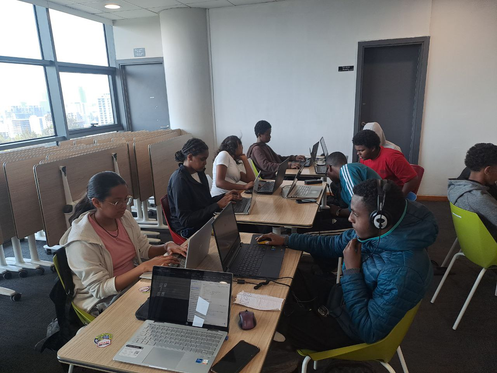

# Andinet Business Club - Official Website



## 🌐 Live Demo
[https://www.shebaww.github.io/Business_Club_Website](https://www.shebaww.github.io/Business_Club_Website)

## 📋 Overview
The official website for the Andinet Business Club - a platform designed to empower the next generation of business leaders through education, networking, and real-world experience. The site serves as a central hub for club information, events, resources, and community engagement.

## ✨ Features

### 🏠 **Home Page**
- Hero section with club mission and value proposition
- Interactive statistics counter (members, events, competitions, resources)
- Three core pillars: Networking, Skill Building, and Competitions
- Smooth animations and modern UI elements

### 👥 **About Page**
- Club history and founding story (2025)
- Four Pillars of Excellence: Academic Rigor, Professionalism, Innovation, Global Impact
- Leadership team showcase with interactive profiles
- Timeline of key milestones

### 📅 **Events Page**
- Dynamic event calendar with date filtering
- Grid/List view toggle
- Category filters (Workshops, Guest Speakers, Competitions, Networking)
- Event search functionality
- RSVP system with visual feedback
- Featured events spotlight
- Detailed event modal with shine animation

### 📚 **Resource Library**
- Categorized resources (Industry Insights, Member Templates, Workshop Archives)
- Search functionality across all resources
- Bookmark/save system for members
- Video workshop archive with simulated player
- Resource preview modals
- Download simulation with Telegram integration

### 🔐 **Telegram Integration**
- Unified popup modal across all pages
- QR code scanning option
- Direct link to club Telegram channel
- Consistent call-to-action for membership

## 🛠️ Technology Stack

- **HTML5** - Semantic markup
- **Tailwind CSS v3** - Utility-first styling
- **Vanilla JavaScript** - No frameworks, pure JS functionality
- **Google Fonts** - Inter typeface
- **Material Symbols** - Icon system
- **Unsplash** - Placeholder imagery

## 📁 Project Structure

```
business-club-website/
│
├── index.html          # Home page
├── About.html          # About us & leadership
├── Events.html         # Events calendar & RSVP
├── Library.html        # Resource library
│
├── icons/              # Image assets
│   ├── bldg.jpg        # Building background
│   ├── profile.png     # Default profile image
│   ├── hero-img.jpg    # Hero section image
│   ├── gdb.jpg         # Graphics design resource
│   ├── mtt.jpg         # Mastering tools thumbnail
│   ├── trad.jpg        # Trading screen image
│   ├── qr_code.png     # Telegram QR code
│   └── favicon.ico     # Site favicon
│
└── README.md           # Project documentation
```

## 🎨 Design System

### Colors
- **Brand Green:** `#25f459` (Neon green)
- **Dark Background:** `#1a1a1a`
- **Accent Dark:** `#052e16`
- **Text:** White with gray variants for hierarchy

### Typography
- **Primary Font:** Inter (sans-serif)
- **Weights:** 300, 400, 600, 700, 800
- **Special Effects:** Text glow, gradient overlays

### UI Components
- Glass-morphism headers with backdrop blur
- Hover animations with scale and shadow effects
- Card-based layouts with interactive states
- Responsive mobile navigation with smooth animations
- Toast notifications for user feedback

## 📱 Responsive Design

- **Desktop:** Full layouts with grid systems (1024px+)
- **Tablet:** Adjusted spacing and column counts (768px - 1023px)
- **Mobile:** Collapsible menu, stacked layouts, touch-friendly buttons (<768px)

## 🔧 Key Functionalities

### Navigation
- Fixed header with active page highlighting
- Mobile-responsive hamburger menu
- Smooth scroll for anchor links

### Interactive Elements
- **Number Counter:** Animated stats on homepage
- **Calendar:** Mini calendar with event indicators
- **Bookmarks:** Save resources to personal library
- **RSVP:** Toggle RSVP status with visual feedback
- **Search:** Real-time filtering across resources/events
- **Modals:** Event details, resource previews, Telegram popup

### User Experience
- Loading states for images (blur-up effect)
- Keyboard shortcuts (ESC to close modals)
- Click-outside to close modals
- Toast confirmations for user actions
- "Load More" pagination for events

## 🚀 Getting Started

### Prerequisites
- Modern web browser (Chrome, Firefox, Safari, Edge)
- Local development server (optional, for local testing)

### Installation
1. Clone the repository:
```bash
git clone https://github.com/yourusername/business-club-website.git
```

2. Navigate to project directory:
```bash
cd business-club-website
```

3. Open any HTML file in your browser:
```bash
open index.html  # Mac
# OR
start index.html # Windows
# OR
python -m http.server 8000  # If using Python
```

### Development
No build process required! The project uses CDN-based Tailwind CSS. Simply edit HTML files and refresh your browser.

## 🌟 Future Enhancements

- [ ] Backend integration for dynamic event management
- [ ] User authentication for personalized experiences
- [ ] Member directory with profiles
- [ ] Newsletter subscription system
- [ ] Real resource downloads (PDFs, templates)
- [ ] Video workshop streaming
- [ ] Discussion forums for members
- [ ] Sponsor showcase section

## 👥 Team

- **Nahom Samuel** - Co-Founder & Lead Developer
- **Nahom Natnael** - Co-Founder & Designer
- **Nahom Solomon** - Secretary & Content Manager
- **Herani & Emas** - Treasurer
- **Amanuel Biyadlgn & Amen Kumsa** - Event Coordinators

## 📞 Contact

- **Telegram:** [@ethiobusinessclub](https://t.me/ethiobusinessclub)
- **Email:** nahomnatnael87@gmail.com
- **School Portal:** [andinet.edu.et](https://www.andinet.edu.et/)

## 📄 License

© 2026 Andinet Business Club. All rights reserved.

---

<p align="center">
  Built with by the Andinet Business Club Team
</p>

